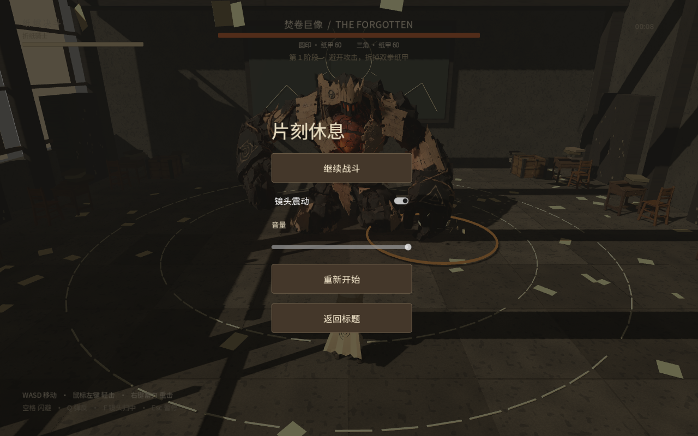

# 纸烬决斗 · Paper Ember Duel

一张废弃教室的灵感图，变成纸片骑士对抗焚卷巨像的 **Godot 单人 3D Boss 战试玩原型**。

**当前版本：v0.2.0 预览版** · Mac 下载试玩 · 含可编辑 Godot 工程与运行模型

[下载 Mac 试玩包与动作演示](https://github.com/AIWHOS/paper-ember-duel/releases/tag/v0.2.0) · [制作过程](docs/纸烬决斗_制作说明_20260910.md)



## 怎么玩

进入废弃教室，避开巨像落拳，趁收招时攻击拳头。分别击破圆印与三角纸甲后，攻击暴露的核心。战斗包含三个阶段、胜负结算、暂停和重试。

| 操作 | 按键 |
|---|---|
| 跑步移动 | WASD |
| 调整镜头 / 镜头归中 | 鼠标左右移动 / F |
| 交替挥剑轻击 | 鼠标左键 |
| 蓄力纵劈 | 按住鼠标右键超过约 0.25 秒后松开 |
| 翻滚闪避 | 空格；有输入时朝移动方向，否则远离巨像 |
| 弹反落拳 | Q |
| 暂停 / 继续 | Esc |
| 结算后重试 | R |
| 保存截图 | F8 |

## Mac 试玩

在 [Releases](https://github.com/AIWHOS/paper-ember-duel/releases/tag/v0.2.0) 下载 Mac ZIP，解压后打开 `.app`。应用包含引擎和游戏数据，不需要安装 Godot。

- 包含 Intel 与 Apple Silicon 两种架构，应用最低系统声明为 macOS 12；目前只完成制作机器上的验证，未完成多机型验收。
- 应用尚未做 Apple 开发者证书签名和公证，下载后可能被 Gatekeeper 阻止。也可以用 Godot 打开下面的源码工程试玩。
- 当前打包版会将日志和 F8 截图保存在当前用户主目录下的 `Codex/纸烬决斗_试玩记录_20260910`。

## 从源码运行

1. 下载或克隆本仓库，保持文件夹结构完整。模型已随工程提供，无需 Hyper3D 账号或 API 密钥即可运行。
2. 在 Godot **4.7.2** 导入 `project.godot`，等待模型、纹理和字体导入完成。
3. 按 F6/F5 运行场景或项目，点击“进入教室”。工程使用 Compatibility 渲染器。

```sh
git clone https://github.com/AIWHOS/paper-ember-duel.git
cd paper-ember-duel
godot --editor --path .
```

上述命令假设 Godot 可执行文件已加入 PATH。也可以直接通过 Godot 项目管理器导入。

## 制作方法

- **GPT-6 / Codex**：参考图理解、玩法规划、代码与迭代调试。
- **Hyper3D Rodin MCP**：生成骑士、巨像和桌椅木箱等 3D 资产。
- **BANG**：完整角色生成后分件，骑士和巨像各得到 8 个网格；它不是自动骨骼绑定。
- **Blender**：处理网格连接、减面、骨骼权重和武器握持位置。
- **Godot**：场景、碰撞、战斗、程序骨骼动作、音效与画面反馈。

这是 Hyper3D 合作案例的制作展示。模型采用 MCP Gen-2.5 Medium / Raw 百万面输出并后处理，未使用网页 Extreme-High。地面、墙体、窗框、书架与黑板是程序搭建的 3D 场景。

## 当前边界

- 已有跑动、挥砍、蓄力重击、翻滚和弹反；动作仍有生硬感，未接入成熟动作库或动作捕捉。
- 攻击使用原型级范围判定，桌椅木箱只有静态碰撞，不能击碎。
- 没有多人联机、更多关卡和正式背景音乐；没有发布 Web / Windows 安装包。
- 演示视频由引擎离线输出，不代表实际实时帧率。不能据此宣称全平台稳定 60 FPS。

## 文件与许可说明

`scripts/` 为游戏逻辑，`assets/` 为运行模型、纹理、字体和音效，`docs/` 为制作说明，`verification/` 用于本地检查输出。大体积高模、Blender 历史文件、账号记录、引擎安装包及生成缓存不包含在仓库内。

Godot 与第三方依赖、字体许可随 `assets/` 提供。项目代码与自有美术尚未指定统一开源许可证；仓库公开不代表所有素材可不受限制地商用或单独再分发。详见 [素材来源说明](docs/纸烬决斗_素材来源说明_20260910.md)。
